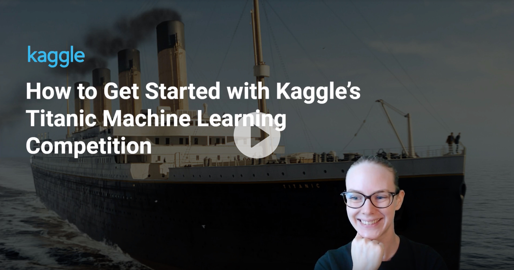

# Titanic-Prediction : Machine Learning from disaster

## Kaggle hosted a Machine Learning contest at <https://www.kaggle.com/c/titanic>

### The contestants have to predict surviving Passengers

This notebook is my prediction

    
    Model selected : GradientBoostingCLassifier
    Accuracy : 0.83

    SVC,KNieghborsClassifier were also considered but gave relatively poor predictions

GradientBoostingClassifier reference : <https://scikit-learn.org/stable/modules/generated/sklearn.ensemble.GradientBoostingClassifier.html>
